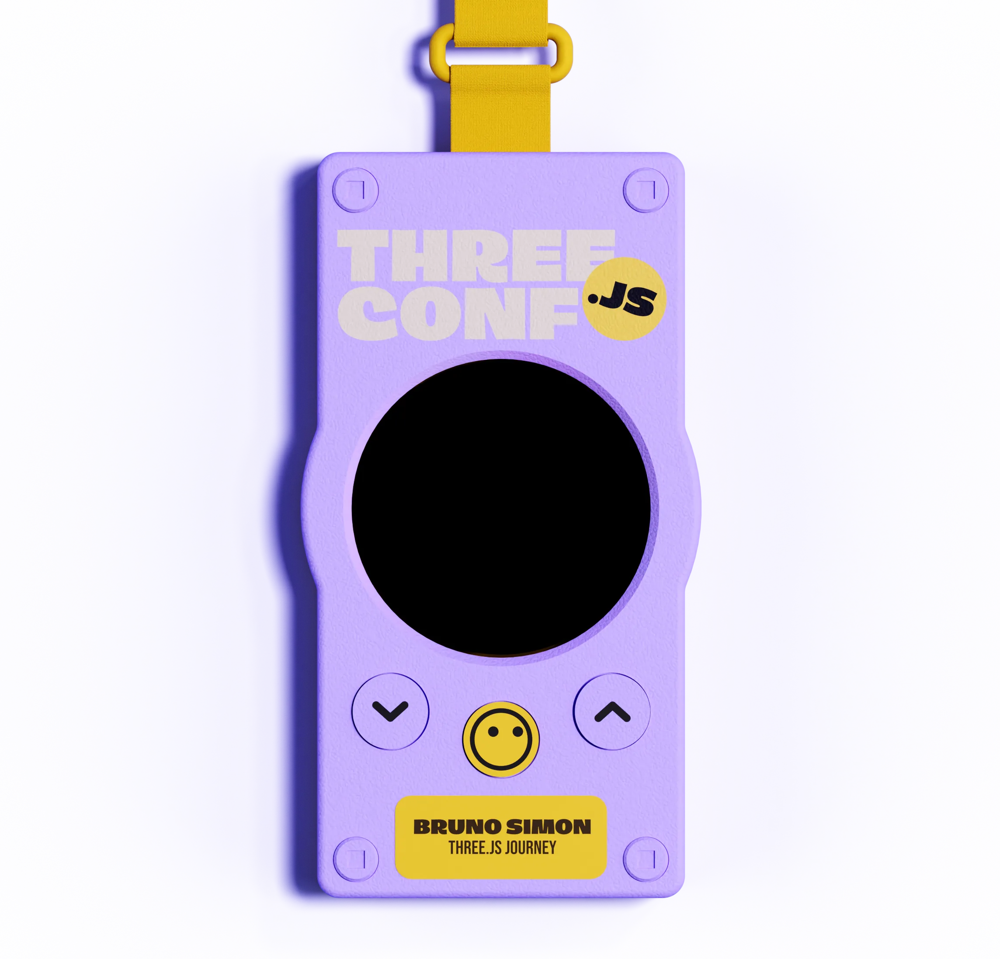

# threejs.paris speaker badge — firmware

Firmware for the electronic speaker badge of the **threejs.paris** conference
(Paris, Sept 10-11 2026). A fleet of 40 badges (+10 spares) was built and worn
by the speakers: round TFT screen, games, animations, badge-to-badge encounters
over ESP-NOW radio, and full configuration from the attendee's phone.

**Try it in your browser** — the real firmware compiled to WebAssembly:
**https://hervestudio.github.io/firmware-badge/**



## Hardware

- **ESP32-S3 N16R8** devkit — 16 MB QIO flash, 8 MB OPI PSRAM
- **2.1" round TFT, GC9B72 controller, 360×360** on a Ø59 mm round PCB
  (backlight driven by GPIO for power-off)
- 3 tactile 6×6 buttons (prev / next / center) + the devkit's BOOT button
- LiPo battery + TP4056 charger / USB-C boost; fuel gauge via a 100k/100k
  resistor divider
- The 3D-printed enclosure and production plates live in the CAD repo
  [hervestudio/speaker-badges](https://github.com/hervestudio/speaker-badges)

## Features

- **Play**: Snake, Pong, Sphere Run, Roundtris (best scores in NVS)
- **Watch**: Conf Buddy (animated avatar), Disco, Globe, DVD, Points, Warp,
  Solar System…
- **Meet**: conference schedule, personal QR code, encounter history,
  fleet-wide leaderboard
- **Social**: badges detect each other over ESP-NOW and share identity +
  game scores; the Conf Buddy reacts when a friend walks by
- **Setup from a phone**: the badge opens a WiFi AP + captive portal; a
  single-page app configures name, company, custom avatar, photo and QR URL
  over WebSocket
- **OTA flashing** over WiFi for fleet maintenance

## Build & flash

Built with [PlatformIO](https://platformio.org/):

```
pio run -e esp32-s3-devkitc-1 -t upload   # production badge (default)
pio run -e ota -t upload                  # WiFi flash: badge in OTA mode
pio run -e proto -t upload                # first prototype (legacy wiring)
```

Flash and logs go through the **UART (CH343) USB port** — the native USB port
is not enumerated because GPIO 19/20 (USB D±) are used as buttons.

## Browser emulator

`tools/emulator/` compiles the **actual firmware sources** to WASM with
emscripten (`./build.sh`). `index.html` shows the badge with a live screen;
`?phone=1` / `?phone=setup` open the paired phone apps, the `m` key simulates
another badge passing by. `headless.js` (node) drives button sequences and
captures screens for testing without hardware.

## Repo layout

- `src/main.cpp` — orchestrator: boot, UI loop, battery, animation dispatch
- `src/dma_flush.h` — async SPI+DMA screen flush (~19 fps at 360×360)
- `src/anims_extra.h`, `src/games.h` — animations and games (portable
  `canvas->` API, shared with the emulator)
- `src/menu_ui.h` — menus and screens (shared firmware/emulator)
- `src/social.h` — ESP-NOW encounters and leaderboard
- `src/setup_mode.h`, `src/draw_mode.h` — phone-paired WiFi apps
- `tools/` — emulator, fleet flashing script, asset generators

See `CLAUDE.md` for the full architecture notes, NVS schema and the list of
hard-won pitfalls (power, radio, DMA, captive portal…).

## License

MIT — see [LICENSE](LICENSE). QR code generation uses the
[Nayuki QR Code generator library](https://www.nayuki.io/page/qr-code-generator-library)
(MIT). The embedded display fonts and the Dingos brand font remain the
property of their respective owners.
